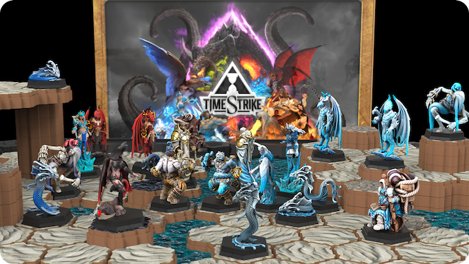
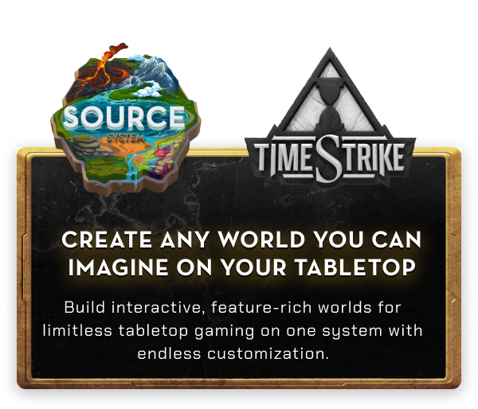
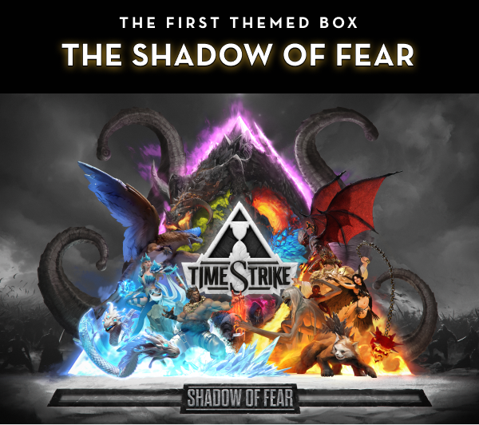

# TimeStrike Rules


## Features

TimeStrike is an accessible miniatures wargame and Boss Battle Royale. With its first themed box set named Shadow of Fear, players will take turns managing a team of characters by moving them through the landscape and performing a variety of actions to survive the end of time and fight off a world boss.




Universes collide as characters from ancient civilizations and distant futures reach the end of time. It is here that history ends, and your adventure begins. 

A malignant Sentience has pulled you into the TimeStrike, a land of decaying universes, creating a rift in time. You must assemble a team, scavenge for loot, mine for materials, complete quests, build defenses, and fight for control of the Sentience, harnessing its massively destructive abilities to be the last team standing to control the Sentience and escape! 

At its core, TimeStrike is a game about the enduring, adaptable, and fierce nature of the human spirit. It’s a game about managing relationships, resources, and the environment itself to overcome adversity against all odds. At the end of time, you may be down, but you’re never out!





The SOURCE system’s hexes and tiles were purpose-built to allow for in-game terrain modularity, with the unique biome artwork directly impacting gameplay.

At the start of every TimeStrike game, players create the world in which they want to battle. This world is called the TimeScape, and it can be constructed without limitations. Mountains, rivers, lakes, forests, deserts, and any biome type can be used to construct the world.  Once the world is built, players place resources, roads, monsters, and to top it all off, the world boss.

TimeStrike is a destructive realm where a great Sentience named Fear forces worlds to enter the same plane. The Sentience is the Boss of the plane, commanding and manipulating the remnants of time.

For the heroes, every moment is a fight for the chance to return to their own timeline.

Due to the nature of SOURCE, TimeStrike is a scalable game. Shadow of Fear box comes with everything needed for games of up to 3 players, but multiple sets and altered rules of TimeStrike can be combined to accommodate groups of any size.



## Contributing

I used the following [link](https://www.geekering.com/programming-languages/filipesalgueiro/how-to-write-latex-documents-using-visual-studio-code/) to setup my local Visual Studio to build this repo.

Pull requests are required to merge back to the main and require approval.

If you are not tech savvy, feel free to make Github Issues detailing your request and somebody will be probably be glad to discuss it with you.

## Setup

### Preparing a new release

1. Run `./bin/bump-version` to tag the new version.

    ```sh
    ./bin/bumpversion <version>
    ```

2. Compile the example PDF.
3. Save the first page of the PDF as scrot.jpg.
4. Update the change log for the new release; commit your changes.
5. Push changes.

    ```sh
    git push && git push --tags
    ```

6. [Create a new release](https://help.github.com/articles/creating-releases/) and attach the PDF and scrot.

## Credits

* Background image from [Lost and Taken](https://lostandtaken.com/)
* Originally forked from [LaTeX-Template](https://github.com/rpgtex/DND-5e-LaTeX-Template)